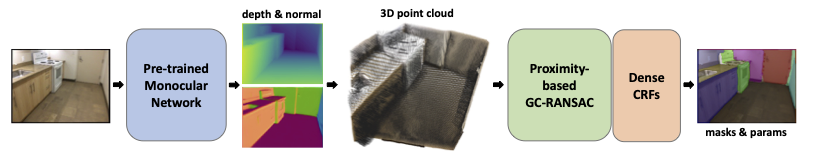

# MonoPlane
Code release of our IROS 2024 oral paper "[MonoPlane: Exploiting Monocular Geometric Cues for Generalizable 3D Plane Reconstruction](https://arxiv.org/abs/xxx)". Code will be released soon. Please stay tuned.

## Introduction



## Citation
Wang Zhao, Jiachen Liu, Sheng Zhang, Yishu Li, Sili Chen, Sharon X Huang, Yong-Jin Liu, Hengkai Guo
```
@inproceedings{zhao2024monoplane,
      author    = {Zhao, Wang and Liu, Jiachen and Zhang, Sheng and Li, Yishu and Chen, Sili and Huang, Sharon X and Liu, Yong-Jin and Guo, Hengkai},
      title     = {MonoPlane: Exploiting Monocular Geometric Cues for Generalizable 3D Plane Reconstruction},
      booktitle = {The IEEE/RSJ International Conference on Intelligent Robots and Systems (IROS)},
      year      = {2024}
  }
```
